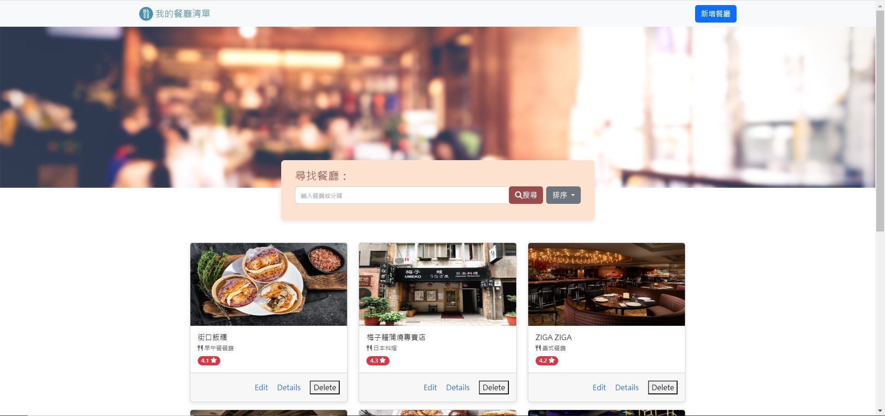

## Restaurant List



### 功能
+ 查看所有餐廳
+ 瀏覽個別餐廳詳細資料
+ 可以名稱或類別搜尋特定餐廳

### 開始使用
1. 請先確認有安裝Node.js及npm
2. Clone本專案至您的電腦：開啟終端機，進入欲存放本專案的資料夾路徑，輸入以下指令

```bash
git clone https://github.com/realyutou/AC_2-3_A1_restaurant_list.git
```

3. 安裝相關套件：輸入以下指令

```bash
  npm install
```

4. 執行此專案：輸入以下指令

```bash
npm run dev
```

5. 若終端機出現以下訊息，代表專案已順利執行，請至瀏覽器進入該網址

```bash
The server is running on http://localhost:3000
```

6. 若欲暫停使用

```bash
ctrl + c
```

### 開發工具
  + Node.js 18.16.0
  + Express 4.16.4
  + Express-handlebars 3.0.0
  + Bootstrap 5.2.3
  + Font-awesome 6.4.0